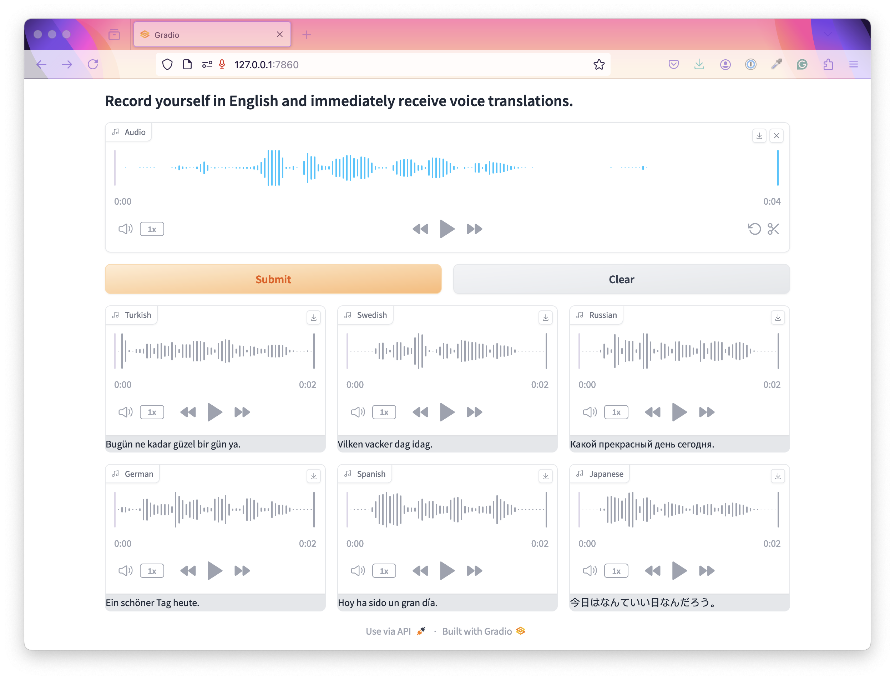

# Voice to Voice Translator

On this web app, you can record your voice in English and create translations of what you said in many different languages. And the best thing is, the created translations will be read out in your own voice.

The technologies used in this app:
1. Gradio for the interface
2. AssemblyAI - for transcription
3. Python translate module - for translation of text
4. Elevenlabs - for reading translated text in your own voice

The API Key you need:
* (AssemblyAI API key)[https://www.assemblyai.com/?utm_source=youtube&utm_medium=referral&utm_campaign=yt_mis_66]
* (Elevenlabs API key)[https://elevenlabs.io/]

Note: you need at least 30 minutes of a voice recording of yourself for the *Professional voice cloning. But there is also a simpler voice cloning option that only requires 30 seconds of voice recording.
*Professional voice cloning is a paid feature.
